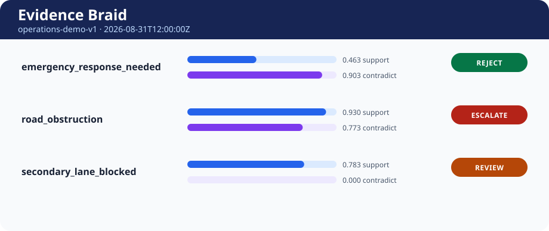

# Evidence Braid

[](https://github.com/appleweiping/evidence-braid/actions/workflows/ci.yml)
[](https://www.python.org/)
[](LICENSE)

Evidence Braid is a small, deterministic decision engine for combining evidence
from vision, audio, text, and sensors. It turns timestamped observations into an
auditable `escalate`, `reject`, or `review` outcome using a plain JSON policy.

It is designed for systems where an operator must be able to answer:

- Which observations affected the decision?
- How much did source reliability and age reduce each observation?
- Were apparently independent signals actually copies of the same event?
- Did a score, quorum, source-diversity, modality-diversity, or margin gate fail?
- Can the exact decision be reproduced later?

Evidence Braid is **not a machine-learning model**, classifier, or truth oracle.
It evaluates evidence already produced by other systems. No network access,
model runtime, or external service is required.



The image above is generated by the checked-in example command. The matching
machine result is [`examples/decision.json`](examples/decision.json), and the
standalone operator report is [`examples/decision.html`](examples/decision.html).

## What it does

1. Parses typed evidence events and a versioned policy with strict JSON validation.
2. Applies configured source reliability.
3. Applies modality-specific exponential confidence decay.
4. Collapses correlated observations so copies cannot manufacture a quorum.
5. Combines independent support and contradiction scores.
6. Enforces thresholds, margin, quorum, source, and modality requirements.
7. Emits a deterministic decision trace, stable digest, HTML report, and SVG.
8. Replays a JSONL stream at every ingestion-time boundary.

The package has no runtime dependencies and supports Python 3.11 or newer.

## Quick start

Clone the repository, create a virtual environment, and install the package:

```bash
python -m venv .venv
source .venv/bin/activate             # Windows: .venv\Scripts\activate
python -m pip install -e .
```

Evaluate the included scenario at a fixed time:

```bash
evidence-braid evaluate examples/policy.json examples/events.jsonl \
  --as-of 2026-08-31T12:00:00Z \
  --output decision.json \
  --html decision.html \
  --svg decision.svg
```

Replay the evidence in ingestion order:

```bash
evidence-braid replay examples/policy.json examples/events.jsonl \
  --output replay.jsonl
```

Use `-` as the output path to write machine output to standard output. Errors
are written to standard error and return exit code `2`.

## A complete event

Each non-empty line in the input JSONL file is one event:

```json
{
  "event_id": "camera-north-0042",
  "claim": "road_obstruction",
  "modality": "vision",
  "source": "camera-north",
  "signal": "support",
  "confidence": 0.91,
  "observed_at": "2026-08-31T11:59:32Z",
  "ingested_at": "2026-08-31T11:59:34Z",
  "correlation_group": "north-frame-0042",
  "attributes": {
    "zone": "northbound"
  }
}
```

| Field | Meaning |
|---|---|
| `event_id` | Globally unique identity used for duplicate detection and traceability. |
| `claim` | Claim evaluated by a correspondingly named policy rule. |
| `modality` | One of `vision`, `audio`, `text`, or `sensor`. |
| `source` | Stable source identity used for reliability and diversity gates. |
| `signal` | `support` or `contradict`. |
| `confidence` | Finite number in the inclusive range `[0, 1]`. |
| `observed_at` | Time the underlying event was observed. Must include a UTC offset. |
| `ingested_at` | Time the decision system learned of it; controls when evidence becomes knowable. |
| `correlation_group` | Optional shared causal identity. Copies in a group count once per signal. |
| `attributes` | Optional finite JSON object, at most 64 levels deep and with integers up to 640 decimal digits, retained by the immutable event model and excluded from scoring. |

Unknown fields, duplicate object keys, and exponents that overflow the finite
float range are rejected. Identifiers must contain
only Unicode text that is safe in XML 1.0 reports. Attribute values must be
ordinary JSON values with finite numbers. These checks catch ambiguous or
unrenderable input instead of quietly running with a weaker policy.
The depth bound applies to the Python API as well as file input and produces a
normal validation error before Python's recursion limit can be reached. The
integer bound keeps accepted Python API values safely serializable under
supported Python versions; subclasses of JSON scalar types are not accepted.

## Policy

Policies are versioned JSON documents:

```json
{
  "schema_version": 1,
  "policy_id": "operations-demo-v1",
  "default_source_reliability": 0.7,
  "sources": {
    "camera-north": { "reliability": 0.94 },
    "acoustic-7": { "reliability": 0.82 }
  },
  "decay": {
    "default_half_life_seconds": 300,
    "modality_half_life_seconds": {
      "vision": 180,
      "sensor": 600
    },
    "max_future_skew_seconds": 2
  },
  "claims": {
    "road_obstruction": {
      "support_threshold": 0.78,
      "contradiction_threshold": 0.82,
      "min_margin": 0.12,
      "quorum": 2,
      "min_sources": 2,
      "min_modalities": 2,
      "min_evidence_confidence": 0.2
    }
  }
}
```

The source-specific reliability wins when present; otherwise the default is
used. Half-life works the same way for modality overrides and the default.
Every configured claim is evaluated, including claims with no evidence.

### Weighting

At evaluation time `T`, each event receives an effective confidence:

```text
age       = max(T - observed_at, 0)
decay     = 2 ^ (-age / half_life)
effective = confidence × source_reliability × decay
```

An observation may be slightly ahead of either its `ingested_at` time or the
evaluation time only within `max_future_skew_seconds`; it is never amplified
above its raw confidence. Larger source-clock skew is rejected consistently by
fixed evaluation and replay, even if evaluation occurs much later. The policy
is the explicit authority for the tolerated skew.

### Correlation and score

Events without a correlation group are independent. Within one explicit group,
only the strongest effective event for each signal is retained. Ties are broken
by event ID, so shuffled input produces exactly the same result.

The retained independent values are combined as:

```text
combined = 1 - product(1 - effective_i)
```

This bounded aggregation rewards corroboration without letting many weak
signals create an unbounded score.

### Gates and outcomes

A retained event qualifies for quorum and diversity only if its effective
confidence is at least `min_evidence_confidence`. A signal passes its
independence gate when it satisfies all three:

- number of qualifying groups is at least `quorum`;
- number of qualifying sources is at least `min_sources`;
- number of qualifying modalities is at least `min_modalities`.

`escalate` requires the support gate, support threshold, and positive
support-minus-contradiction margin. `reject` applies the symmetric conditions to
contradiction. Every ambiguous, under-threshold, insufficiently independent, or
balanced result becomes `review`. The engine never silently turns uncertainty
into a confident decision.

## Machine output

The result contains:

- input and considered counts plus not-yet-ingested event IDs;
- one decision per configured claim;
- combined support and contradiction scores;
- the outcome and exact reason code;
- quorum/source/modality gate details;
- each event's raw confidence, reliability, age, decay, and effective value;
- representatives and suppressed members of each correlation group;
- a SHA-256 digest over the canonical result payload.

Computed floats are stabilized to 12 decimal places for both policy comparisons
and public output. Correlation ranking and score aggregation use that same
precision, so hidden floating-point tails cannot disagree with a displayed
threshold or tie. Negative zero is normalized to ordinary zero. The digest
does not include itself. It is an integrity and
reproducibility aid, not a digital signature.

## Replay semantics

`replay` validates and sorts the stream by `(ingested_at, event_id)`, then
evaluates only the knowable prefix after each distinct ingestion timestamp. All
events arriving at the same timestamp appear atomically in one snapshot.
Appending a valid later event does not change an earlier snapshot, its input
count, or its digest. Observed time controls decay; ingestion time controls when
an event becomes knowable.

Replay output is JSONL: one compact result per snapshot. The same strict event,
claim, duplicate-ID, future-skew, and policy validation applies as in a
fixed-time evaluation.

## Python API

```python
from evidence_braid import EvidenceEvent, Policy, evaluate
from evidence_braid.models import parse_timestamp

policy = Policy.from_dict(policy_document)
events = [EvidenceEvent.from_dict(item) for item in event_documents]
result = evaluate(policy, events, parse_timestamp("2026-08-31T12:00:00Z", "as_of"))

print(result.decisions[0].outcome.value)
print(result.digest)
```

Public model constructors validate their typed fields, defensively snapshot
collections, and recursively freeze event attributes; `dataclasses.replace`
cannot be used to inject mutable state. Timestamps are normalized to built-in
UTC `datetime` instances; behavior-overriding subclasses are rejected. Each
`to_dict()` call returns a detached JSON-ready copy. `render_html(result)` and
`render_svg(result)` return standalone text; they do not write files or make
network requests.

## Baselines and labeled metrics

Two deliberately transparent baselines and dependency-free labeled metrics are available for
evaluation—not as alternative production policies:

```python
from evidence_braid import classification_metrics, majority_vote, reliability_weighted_vote

majority = majority_vote(policy, events, as_of)
weighted = reliability_weighted_vote(policy, events, as_of)

metrics = classification_metrics(
    labels={"case-1": "escalate", "case-2": "reject"},
    predictions={"case-1": majority[0].outcome, "case-2": "review"},
    support_probabilities={"case-1": majority[0].support_probability, "case-2": 0.5},
)
```

`majority_vote` counts visible events equally. `reliability_weighted_vote` sums confidence times
static source reliability. Their omissions are intentional and documented so ablation comparisons
remain interpretable. Metrics include accuracy, coverage, selective accuracy, precision, recall,
F1, Brier score, fixed-bin expected calibration error, and an abstention-preserving confusion
matrix. See the [complete evaluation protocol](docs/evaluation.md).

## Determinism contract

For the same validated policy, event set, and `as_of` instant:

- input order does not affect a decision or digest;
- adding later replay input does not change any earlier valid snapshot;
- values tied at the public 12-decimal precision use lexical event IDs;
- claim output order is lexical;
- timestamps are normalized to UTC;
- serialization uses sorted keys and fixed separators for the digest;
- there is no random number generation, wall-clock read, network call, or ML inference.

Changing Python implementations can alter low-level floating-point arithmetic.
Computed values are therefore stabilized before both comparisons and
serialization. Golden demo artifacts are regenerated and checked after logic
changes.

## Safety and scope

Evidence Braid is decision-support infrastructure. It does not validate whether
an upstream detector is accurate, a source is honest, a claim is well framed,
or a policy is appropriate. Operators remain responsible for those choices.

Do not use it as the sole authority for decisions that affect life, safety,
rights, employment, credit, medical care, or legal status. For consequential
systems, add domain review, access control, signed provenance, retention rules,
monitoring, incident response, and an operator override outside this library.

Known scope boundaries:

- confidence calibration is supplied by the caller;
- source reliabilities are static within one policy;
- correlation groups are declared, not inferred;
- one event addresses one claim and one signal;
- policy migration beyond schema version 1 is not yet implemented;
- file and line sizes are not capped by the dependency-free adapters;
- the HTML report is a portable snapshot, not a dashboard or evidence store.

The repository's checked-in experiment uses generated synthetic labels and cannot establish
real-world accuracy, fairness, safety, or calibration. Read the
[research and deployment limitations](docs/research-limitations.md) before interpreting results.

## Reproduce the evaluation

```bash
python experiments/synthetic_baselines.py \
  --samples 240 --seed 1729 --repeats 5 --replay-events 80 \
  --output experiment.json
```

The result is machine-readable and records dataset and prediction hashes, class counts, metric and
calibration details, replay characterization, Python/OS/CPU metadata, warmup, repetitions, and
timing distributions. It also records the software version, fixed evaluation time, generator
version, and complete canonical policy hash. Output replacement is atomic and experiment sizes have
documented hard ceilings. Timings characterize only that run. A smaller
[checked-in reference result](experiments/results/synthetic-baselines-windows-python314.json)
demonstrates the schema with explicit synthetic-data provenance.

## Development

```bash
python -m pip install -e ".[dev]"
ruff check .
ruff format --check .
pytest --cov=evidence_braid --cov-report=term-missing
python experiments/synthetic_baselines.py --samples 12 --repeats 3 --replay-events 8
```

The test suite covers decay, source reliability, correlation collapse,
conflicts, stable threshold boundaries, diversity gates, duplicate and
malformed input, Unicode/report safety, ingestion semantics, prefix-stable
replay, immutable traces, reports, CLI behavior, and order determinism.

See [`docs/architecture.md`](docs/architecture.md) for design boundaries,
[`docs/compatibility.md`](docs/compatibility.md) for the versioning contract,
[`docs/governance.md`](docs/governance.md) for decision authority, and
[`CONTRIBUTING.md`](CONTRIBUTING.md) for the contribution workflow. Release verification is
documented in [`docs/releases.md`](docs/releases.md), and versioned citation metadata is provided
in [`CITATION.cff`](CITATION.cff).

## Roadmap

- JSON Schema documents for policy and events.
- Signed result envelopes through an optional adapter.
- Policy comparison that explains why two versions differ.
- Streaming adapter with explicit snapshot boundaries.
- Additional report accessibility testing.

## Companion repositories

Evidence Braid is one independent part of a small multimodal tooling suite. [Payload Palette](https://github.com/appleweiping/payload-palette) validates request media, [Frame Quorum](https://github.com/appleweiping/frame-quorum) selects auditable key frames, [Graph Sail](https://github.com/appleweiping/graph-sail) plans heterogeneous DAGs, and [Stream Quilt](https://github.com/appleweiping/stream-quilt) aligns event streams. The repositories have separate contracts and release cycles; no runtime dependency is implied.

## License

Evidence Braid is available under the [MIT License](LICENSE).
